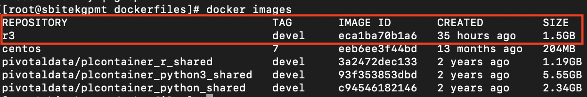

# R docker image 생성 방법

1. 사전 검토 사항
- image 생성 할 환경에 docker가 설치 되어 있어야 함.
- online 환경에서 만 생성 가능

2. Greenplum OpenSource Github 에서 dockerfile을 다운 받아 저장
    (https://github.com/greenplum-db/plcontainer/tree/2.1.4/dockerfiles)

    plcontiner version 별로 docker image가 다르므로 plcontiner 버전에 해당하는 branche/tag 를 선택하여 받아야 함.
    (docker image의 os 가 plcontiner version 별로 다름)

3. 다운받은 dockerfile 을 열어 추가적으로 필요한 라이브러리 설치 명령 추가 (plcontainer 2.1.4 기준)

    ```
    FROM centos:7

    EXPOSE 8080

    RUN mkdir -p /clientdir
    RUN yum install -y epel-release
    RUN yum install -y R

    ENV R_HOME "/usr/lib64/R"
    ENV PATH "/usr/lib64/R/bin:$PATH"
    ENV LD_LIBRARY_PATH "/usr/lib64/R/lib:$LD_LIBRARY_PATH"

    # R library wget & install
    # Source 의 경우 depandency 확인 필요
    #wget https://cran.r-project.org/src/contrib/Archive/PivotalR/PivotalR_0.1.18.4.tar.gz 
    #R CMD INSTALL PivotalR_0.1.18.4.tar.gz

    #R-cran install
    #Rscript -e "install.packages(c('TSA','ggplot2'), dependencies=TRUE, repos='https://cloud.r-project.org/')"

    rm *.tar.gz

    WORKDIR /clientdir
    ```

4. docker build 명령으로 image build
    ```
    $ docker build -f <dockerfile> -t <image_repository>:<tag> <destpath>

    ex) 
    $ docker build -f ./Dockerfile.r.add -t r3:devel .

    ```

    명령 실행시 dockerfile에 명시된 명령을 수행하여 이미지를 생성함. 

5. docker image 확인
    ```
    $ docker images
    ```
    docker build 명령으로 이미지가 생성된 것을 볼 수 있다.

    
6. docker image export

    ```
    $ docker save -o <export_file_name>.tar <image_repository>:<tag>
    
    ex)
    $ docker save -o R-3.6.0-plcontainer-2.4.1-image.tar r3:devel
    ```
    
7. (optional) 만들어진 이미지에 라이브러리 추가 설치
    ```
    1. container 실행 
    - docker run -ti <image id> /bin/bash

    2. 다른 ssh 세션에서 container 에 python package 넣기 
    - docker cp <hostFilePath> <container_name>:<containerPath> 

    3. 1번에서 실행중인 container 내 bash shell 에서 다운로드 한 library 설치 
    - R: R CMD INSTALL <package file name>
    - python3: pip3 install [package file]
    - python2: pip2 install [package file]

    4. 다른 ssh 세션에서 실행중인 container 이미지 export 
    - docker export <container id or name> > <export file name>.tar

    5. 1번에서 실행한 container 종료 - exit

    6. plcontainer 명령으로 기존 image 제거 
    - plcontainer image-delete -i <image name>

    7. plcontainer 명령으로 4에서 export 한 이미지 추가 
    - plcontainer image-add <export file name>

    6.모든 gpdb node에 배포된 이미지의 tag 변경 
    - gpssh -f [hostall] "docker image tag <image id> <REPOSITORY>:<TAG>"

    ```